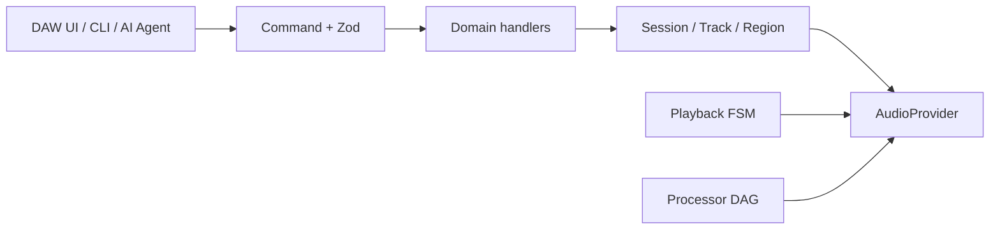

# DAW Engine

TypeScript library for non-destructive multitrack editing in the browser and Electron.

It keeps `Session`, `Track`, `Region`, and `Source` as the domain model, and runs move, split, trim, fade, and other edits as commands. The same command interface can drive a DAW UI, a CLI, or an AI agent.

This repository is the canonical source. It is used as the audio editing core in AnAI Media Editor, behind a product-specific adapter so UI and platform code stay decoupled.

## Why these boundaries

- **Commands + Zod:** about 70 edit operations share one `{ type, payload }` shape. Invalid input is rejected before a handler runs, so UI, CLI, and agents cannot bypass validation.
- **Playback FSM:** play, stop, seek, and reverse are explicit transitions. Commands that arrive during declick are queued instead of racing the audio engine.
- **Processor DAG:** audio processing steps declare dependencies, then run in a safe order with cycle detection. Write-up: [Why audio processor order is modeled as a DAG](https://devlog.dropai.site/posts/daw-engine-processing-dag).



The library does not depend on React, Electron, or a specific audio runtime. You bring the UI and an `AudioProvider` implementation.

## Features

- DAW domain model based on `Session`, `Track`, `Region`, and `Source`
- Command execution with Zod validation and handlers
- Undo/redo and transactions
- Non-destructive editing that preserves the original audio
- Replaceable `AudioProvider` interface
- Timeline, waveform, and canvas calculation utilities
- State change subscriptions based on `Signal<T>`
- Session serialization and restoration

## Packages

| Package                              | Description                                                |
| ------------------------------------ | ---------------------------------------------------------- |
| [`@daw-engine/core`](./core)         | DAW domain, commands, history, and audio backend interface |
| [`@daw-engine/ui-utils`](./ui-utils) | Timeline, waveform, and canvas rendering calculations      |

`ui-utils` depends on `core`. If you do not need timeline or waveform features, you can install `core` only.

## Installation

Before the packages are published to the npm registry, use a Git dependency pinned to a commit SHA for reproducible installation.

```json
{
  "dependencies": {
    "@daw-engine/core": "git+https://github.com/HURRAEY/daw-engine.git#<commit-sha>"
  }
}
```

The Git dependency does not run installation scripts. It exports prebuilt JavaScript and type declarations from `package-dist`.
Consumers can use standard package imports.

When implementing only an `AudioProvider` adapter in the browser, use the narrower subpath instead of the full public API.

```typescript
import {
  AudioEngine,
  type AudioProvider,
} from "@daw-engine/core/browser-adapter";
```

```bash
npm install @daw-engine/core
```

To use the timeline and waveform utilities, install both packages.

```bash
npm install @daw-engine/core @daw-engine/ui-utils
```

## Quick Start

### Create a session

```typescript
import { Session, TrackType } from "@daw-engine/core";

const session = new Session("My Song", undefined, 48_000);

const vocalTrack = session.addTrack("Vocal", TrackType.AUDIO);

vocalTrack.setArmed(true);
session.setTempo(120);

const snapshot = session.toJSON();
const restoredSession = Session.fromJSON(snapshot);
```

### Execute a command

Before executing a command, connect an `AudioProvider` for your product environment to `AudioEngine`.

```typescript
import { AudioEngine, CommandExecutor, CommandType } from "@daw-engine/core";

AudioEngine.getInstance(audioProvider);

const executor = CommandExecutor.getInstance();

const result = await executor.execute({
  type: CommandType.ADD_TRACK,
  payload: {
    name: "Guitar",
    trackType: "audio",
  },
});

if (!result.success) {
  throw new Error(result.message);
}

await executor.history.undo();
await executor.history.redo();
```

### Timeline coordinates

```typescript
import { TimelineViewport } from "@daw-engine/ui-utils";

const viewport = new TimelineViewport(48_000);

viewport.setDuration(180);
viewport.setViewportWidth(1_200);
viewport.setPixelsPerSecond(100);

viewport.frameToPixel(48_000); // 100
```

### Waveform peaks

```typescript
import { computePeaksFromSamples } from "@daw-engine/ui-utils";

const samples = new Float32Array([0, 0.25, 0.5, -0.5, -0.25, 0]);

const peaks = computePeaksFromSamples(samples, 2);
```

## Core Concepts

### Command

Editing operations are represented as data in the form `{ type, payload }`.

UI buttons, keyboard shortcuts, scripts, and automation can use the same command format. Inputs are validated against Zod schemas before execution.

### Non-destructive editing

`Source` represents the original audio, while `Region` represents an instance of a source placed on the timeline.

Multiple regions can reference the same source, allowing you to edit without modifying the original file.

### AudioProvider

DAW Engine does not directly implement audio playback or recording.

The `AudioProvider` interface connects playback, recording, region scheduling, metering, and export features to your product's Web Audio or native audio implementation.

## Documentation

- [Core documentation](./core/README.md)
- [UI Utils documentation](./ui-utils/README.md)
- [AudioProvider interface](./core/src/audio/AudioProvider.ts)

## Requirements

- Node.js 18 or later
- A runtime or bundler that supports ESM
- An `AudioProvider` implementation for playback and recording
- Web APIs such as Canvas, `AudioBuffer`, and `requestAnimationFrame`, depending on the features you use

## Status

DAW Engine currently provides a command-oriented editing architecture, but it does not require every state change to use a command.

Not every command or state change supports undo/redo. Before integrating DAW Engine into a product, verify the commands you use and your `AudioProvider` implementation separately.

## Troubleshooting

- **No sound after `execute`:** connect an `AudioProvider` with `AudioEngine.getInstance(audioProvider)` before running commands. The core does not play audio by itself.
- **Undo skipped a UI-only change:** some state updates are not recorded as commands. Wrap product edits in a command or a transaction if they must undo together.
- **Install from Git, not npm:** packages are not on the npm registry yet. Pin a commit SHA as shown in [Installation](#installation).
- **Browser vs Electron:** keep product adapters outside `@daw-engine/core`. Import `@daw-engine/core/browser-adapter` only when implementing an `AudioProvider` in the browser.

## Development

Install and verify each package independently.

```bash
cd core
pnpm install
pnpm test
pnpm typecheck
pnpm build
```

```bash
cd ui-utils
pnpm install
pnpm typecheck
pnpm build
```

## License

MIT
